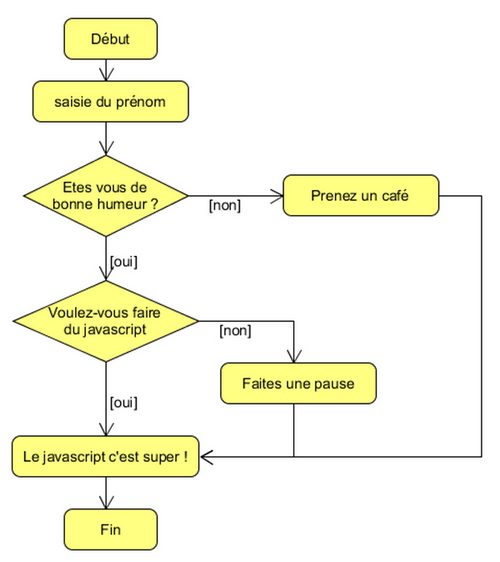
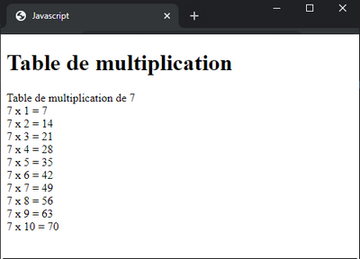

# Javascript - les bases - Exercices

## VARIABLES ET VALEURS

### Exercice : Tentez de prévoir les valeurs

    let a = 2;
    a -= 1;
    a++;
    let b = 8;
    b += 2;
    const c = a + b * b;
    const d = a * b + b;
    const e = a * (b + b);
    const f = a * b / a;
    const g = b / a * a;
    console.log(a, b, c, d, e, f, g);

### Exercice : Permutation de variable

    let nombre1 = 5;
    let nombre2 = 3;

    //Complétez le programme afin qu'il permute les valeurs des deux variables.
    //Attention : le code doit fonctionner quelle que soit les valeurs des variables !
    //Astuce : vous n'êtes pas limité à l'utilisation de deux variables seulement ...

    console.log("nombre1 = " + nombre1); // nombre1 = 3
    console.log("nombre2 = " + nombre2); // nombre2 = 5

### Exercice : Interaction avec l'utilisateur

Récupérez le prénom de l'utilisateur et son année de naissance. 
Calculez son âge et affichez son prénom et son âge sur la page.

## LES TESTS : IF et SWITCH

### Exercice : Créez votre propre chabot

Programmez un chatbot, comme par exemple :

Pour les plus avancés : créez votre propre chabot complet !

### Exercice : Jour suivant

    const jourActuel = "lundi";
    let jourSuivant = "";

    // Complétez le code pour qu'il affiche le jour suivant le jour actuel.
    // Testez-le en modifiant la valeur de la variable jourActuel.

    console.log(`Demain, nous serons ${jourSuivant}`);

### Exercice : Calculatrice

    // Calculatrice
    let nbGauche=12;
    let nbDroite=6;
    let operation="-";
    let resultat;

    // Complétez ce programme pour afficher le résultats des 4 opérations de base+ - * /
    // Tesez-le en modifiant la valeur des variables

    console.log(resultat);

## LES BOUCLES : FOR ET WHILE

### Exercice : La table de multiplication

Sauriez-vous automatiser l'affichage de la table de multiplication ? 
Demandez un chiffre à l'utilisateur, et si le chiffre est correct, afficher la table dans la page Html. 
Si l'utilisateur renseigne un nombre incorrect, proposez-lui de le ressaisir.

### Exercice : Le nombre Mystère

Faites choisir un nombre aléatoire à l'ordinateur, entre 1 et 100.  
Pour cela, vous pouvez utiliser la fonction Math.random : https://developer.mozilla.org/fr/docs/Web/JavaScript/Reference/Objets_globaux/Math/random 

Par exemple :

    let nombre = Math.floor(Math.random()*99+1);

Puis faites deviner ce nombre aléatoire à l'utilisateur :

- S’il le trouve, c'est gagné !
- Si le nombre proposé est trop grand ou trop petit : dites-le-lui et demandez-lui un autre nombre

Enfin, limitez enfin le nombre de tentatives à 10.

### Exercice : FizzBuzz

Ecrivez un programme qui affiche tous les nombres entre 1 et 100 avec les exceptions suivantes :

- Il affiche "Fizz" à la place du nombre si celui-ci est divisible par 3.
- Il affiche "Buzz" à la place du nombre si celui-ci est divisible par 5 et non par 3.
- Il affiche "FizzBuzz" à la place du nombre si celui-ci est divisible à la fois par 3 et par 5.

Vous pouvez utiliser l'opérateur modulo % qui renvoie le reste de la division d'un entier par un autre

        console.log(10 % 2); // 0
        console.log(10 % 3); // 1
        console.log(11 % 3); // 2
        console.log(12 % 3); // 0

 

> Corrections [Partie_1_Exercices_corrections.md](Partie_1_Exercices_corrections.md)
