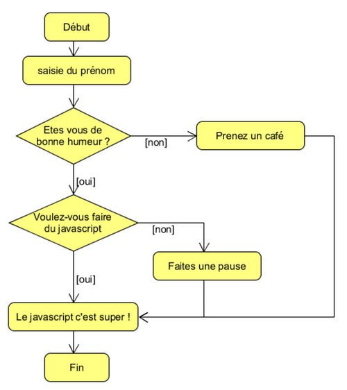
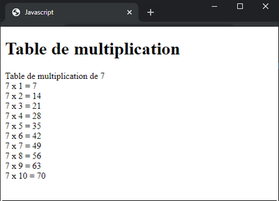

# Javascript - les bases - Exercices

## 4. VARIABLES ET VALEURS

### Exercice : Permutation de variable

    let nombre1 = 5;
    let nombre2 = 3;

    //Complétez le programme afin qu'il permute les valeurs des deux variables.
    //Attention : le code doit fonctionner quelle que soit les valeurs des variables !
    //Astuce : vous n'êtes pas limité à l'utilisation de deux variables seulement ...

    console.log("nombre1 = " + nombre1); // nombre1 = 3
    console.log("nombre2 = " + nombre2); // nombre2 = 5

## 5. LES TESTS : IF

### Exercice : Créez votre propre chabot

Programmez un chatbot, comme par exemple :

Pour les plus avancés : créez votre propre chabot complet !

## 8. LES BOUCLES : FOR ET WHILE

### Exercice : La table de multiplication

Sauriez-vous automatiser l'affichage de la table de multiplication ? 
Demandez un chiffre à l'utilisateur, et si le chiffre est correct, afficher la table dans la page Html. 
Si l'utilisateur renseigne un nombre incorrect, proposez-lui de le ressaisir.

### Exercice : Le nombre Mystère

Faites choisir un nombre aléatoire à l'ordinateur.  
Pour cela, vous pouvez utiliser la fonction Math.random : https://developer.mozilla.org/fr/docs/Web/JavaScript/Reference/Objets_globaux/Math/random 

Par exemple :

    let nombre = Math.floor(Math.random()*99+1);

Puis faites deviner ce nombre aléatoire à l'utilisateur :

- S’il le trouve, c'est gagné !
- Si le nombre proposé est trop grand ou trop petit : dites-le-lui et demandez-lui un autre nombre

Enfin, limitez enfin le nombre de tentatives à 10.

## 9. LES TABLEAUX

### Exercice : Somme du tableau

Complétez le programme pour calculer puis afficher la somme des valeurs du tableau :

    const nombres = [11, 3, 7, 2, 9, 10];
    let somme = 0;

    // Ajoutez votre code ici

### Exercice : Valeur maximale du tableau

Complétez le programme pour afficher la valeur la plus grande du tableau :

    const valeurs = [3, 11, 7, 2, 9, 10];
    let max;

    // Ajoutez votre code ici
