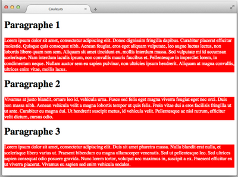
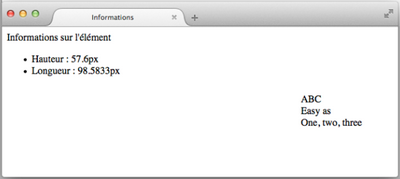

# Javascript - les bases - Exercices

## Manipulation du DOM

### Exercice : Mon rêve familier

Créez un fichier html contenant le body suivant :

    <h1>Mon rêve familier</h1>
    
Je fais souvent ce rêve étrange et pénétrant

    
D'une femme inconnue, et que j'aime, et qui m'aime

    
Et qui n'est, chaque fois, ni tout à fait la même

    
Ni tout à fait une autre, et m'aime et me comprend.

    
Paul Verlaine

Créez ensuite le script JS conforme aux instructions suivantes :

- Récupérer tous les paragraphes et afficher leur contenu textuel uniquement dans la console
- Inverser les adjectifs 1 et 2

### Exercice : Compter les éléments

Créez un fichier html contenant le body suivant :

    <h1>Mon rêve familier (Paul Verlaine)</h1>
    
Je fais souvent ce rêve étrange et pénétrant

    
D'une femme inconnue, et que j'aime, et qui m'aime

    
Et qui n'est, chaque fois, ni tout à fait la même

    
Ni tout à fait une autre, et m'aime et me comprend.

Ajoutez-y le script suivant :

    // TODO : écrire la fonction compterElements

    console.log(compterElements("p")); // Doit afficher 4
    console.log(compterElements(".adjectif")); // Doit afficher 3
    console.log(compterElements("p .adjectif")); // Doit afficher 3
    console.log(compterElements("p > .adjectif")); // Doit afficher 2

Ecrivez la fonction compterElements afin que le reste du programme fonctionne.

## Manipulation du DOM avec les propriétés d'attributs et de classe

### Exercice : instruments de musique #1

Créez un fichier html contenant le body suivant :

    <h1>Quelques instruments de musique</h1>
    <ul>
        <li id="clarinette" class="vent bois">
            La <a href="https://fr.wikipedia.org/wiki/Clarinette">clarinette</a>
        </li>
        <li id="saxophone" class="vent bois">
            Le <a href="https://fr.wikipedia.org/wiki/Saxophone">saxophone</a>
        </li>
        <li id="trompette" class="vent cuivre">
            La <a href="https://fr.wikipedia.org/wiki/Trompette">trompette</a>
        </li>
        <li id="violon" class="cordes frottees">
            Le <a href="https://fr.wikipedia.org/wiki/Violon">violon</a>
        </li>
    </ul>

Créez ensuite le script JS et écrivez la fonction **infosLien** qui doit afficher :

- le nombre total de liens dans la page web
- la cible du premier et du dernier lien.

Attention : cette fonction doit afficher un résultat correct quel que soit le nombre de liens présents dans la page.

### Exercice : instruments de musique #2

Ajoutez à votre script le code suivant :

    possede("saxophone", "bois"); // Doit afficher true
    possede("saxophone", "cuivre"); // Doit afficher false
    possede("trompette", "cuivre"); // Doit afficher true
    possede("contrebasse", "cordes"); // Doit afficher une erreur

Puis écrivez la fonction **possede** qui vérifie qu'un élément possède une classe.

## Manipulation du DOM avec la propriété style

### Exercice : Colorations

Créez un fichier html contenant trois paragraphes précédé chacun d'un titre "h2".
Créez un script afin de permettre à l'utilisateur de saisir la nouvelle couleur pour le texte puis la nouvelle couleur de fond des trois paragraphes de la page web.

### Exercice : Informations

Créez un fichier html contenant le body suivant :

    
ABC
         Easy as
         One, two, three
    

    

Et le css suivant :

    #contenu {
        float: right;
        margin-top: 100px;
        margin-right: 50px;
    }

Enfin, créez le script qui ajoute à la page web une liste affichant la hauteur et la largeur de l'élément identifié par "contenu" :

## Ajout de nouveaux éléments sur le DOM

### Exercice : Journaux en ligne

Créez un fichier html contenant le body suivant :

    <h1>Quelques journaux en ligne</h1>
    

Ajoutez-y le script suivant :

    // Liste des journaux
    let journaux = ["http://lemonde.fr", "http://lefigaro.fr", "http://liberation.fr"];

Complétez votre script afin d'ajouter la liste des liens vers les journaux en ligne, dans la div contenu.
Vous devez utiliser le tableau journaux et chaque lien doit être cliquable.

### Exercice : Mon petit dico

Créez un fichier html contenant le body suivant :

    <h1>Un mini-dictionnaire</h1>
    

Ajoutez-y le script suivant :

    // Liste des mots du dictionnaire
    var mots = [
        {
            terme: "Procrastination",
            definition: "Tendance pathologique à remettre systématiquement au lendemain"
        },
        {
            terme: "Tautologie",
            definition: "Phrase dont la formulation ne peut être que vraie"
        },
        {
            terme: "Oxymore",
            definition: "Figure de style qui réunit dans un même syntagme deux termes sémantiquement opposés"
        }
    ];

Complétez votre script afin créer le dictionnaire sur la page web, dans la div "contenu".

